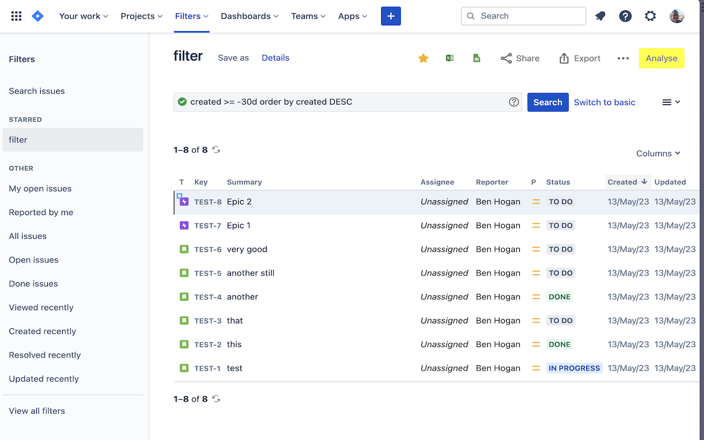
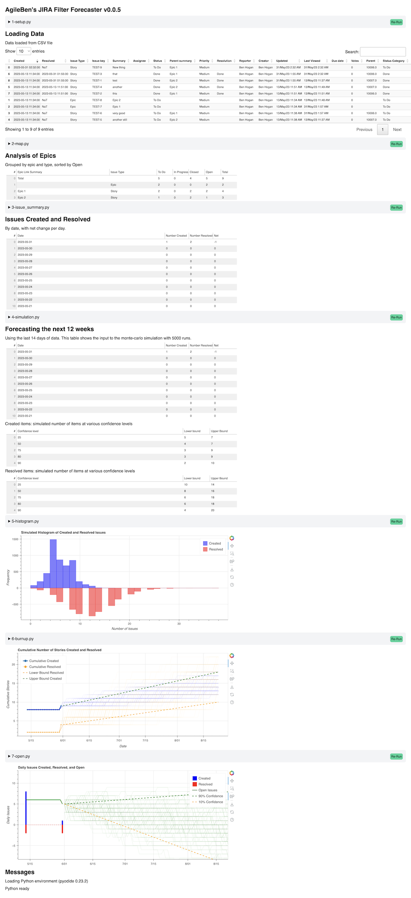

# agileben-jira-forecaster

This is the start of a chrome extension to analyse JIRA filters. 

It adds an "Analyse" button to the filter page in JIRA. 

When clicked loads the CSV data from your filter into memory. Data never leaves your computer.

The csv file is analysed using Python running *locally* in your browser using the amazing Pyodide library (Python in javascript / wasm).

The charts use the python library Bokeh.

Most of the code was written by ChatGPT over a weekend.

## Now available on the Chrome Web Store

Released to the Chrome Web Store: [get it here](https://chrome.google.com/webstore/detail/agileben-jira-filter-fore/ibnaoiepdopjpbpmelhlhdbopicfjgfo)

- Upgraded to using a background worker: no longer blocks the page while running
- Added code viewer and "re-run" button to allow experimenting with analysis code
- Upgraded to latest Chrome Plugin V3 Manifest

## Alpha Testing - Installation Instructions

- Download latest code: https://github.com/agileben/agileben-jira-forecaster/archive/refs/heads/main.zip
- Extract the zip file
- Go to your "Manage Extensions" page in Chrome / Chromium-based-browsers
- Turn on "Developer Mode"
- Click "Load Unpacked"
- Select the folder you extracted

## Experimenting with code changes locally
- To change the number of weeks to forecast or days history to include in the simulation make changes in [```simulation.py```](https://github.com/agileben/agileben-jira-forecaster/blob/3064ccef822f2af1e3db0574fa24dd84f7aba1a4/4-simulation.py#L25) 
- In 'Manage Extensions' click the reload icon

## Screenshots

Adds a button to the JIRA filter page (top right)


Creates a forecast report

- The report is interactive: you can zoom in and out of the charts
- You can also download the charts as a PNG or SVG


## Inspiration
- Inspired by the generous publications of [Troy Magennis's analysis excel tools](https://github.com/FocusedObjective/FocusedObjective.Resources) and 
- the tool [ActionableAgile by 55 Degrees](https://actionableagile.com/)

Licence:
- This work is licensed under a Creative Commons Attribution-NonCommercial 4.0 International License. (c) Ben Hogan 2023
- Free for non commercial use (You can't sell this)
- CC share alike: include attribution: "Based on https://github.com/agileben/agileben-jira-forecaster by Ben Hogan"


